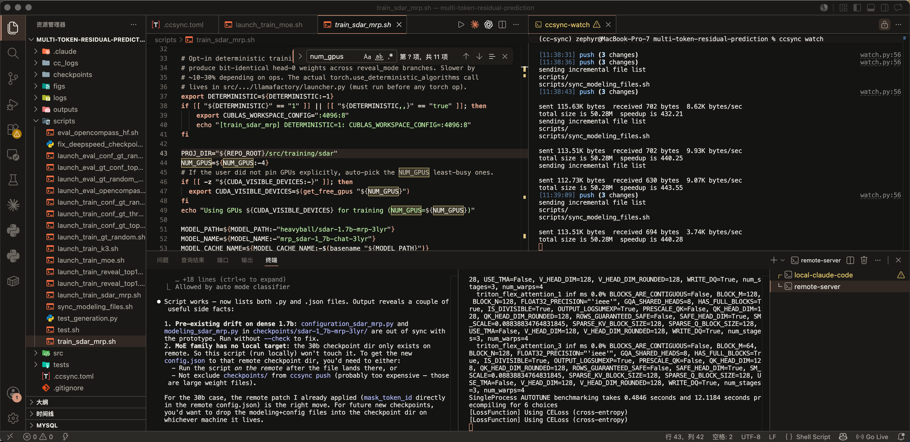

<p align="center">
  
</p>

Edit locally, run remotely. A small Python CLI that mirrors your working tree to a remote host via one-way `rsync`.

## Install

```bash
conda create -n cc-sync python=3.12 -y
conda activate cc-sync
cd cc-sync
pip install -e .
```

## Quick start
cc-sync is best for quick testing and debugging, and below are the core commands for this purpose.
```bash
cd my-project
ccsync init                       # writes .ccsync.toml
ccsync push                       # one-shot rsync to remote
ccsync watch                      # auto-sync on every save (Ctrl-C to stop)
```

My typical workflow:
<p align="center">
  
</p>

- top left: editor.
- bottom left: claude code on local.
- top right: ccsync watcher, synchronize local changes to the remote machine on every local save.
- bottom right: a terminal on the remote, running my training/inference workload.

## Config (`.ccsync.toml`)

```toml
[remote]
host = "mybox"          # ~/.ssh/config alias
path = "/home/me/proj"
# Optional — set these if `~/.ssh/config` doesn't already resolve them.
# user = "ubuntu"
# port = 22
# identity_file = "~/.ssh/id_ed25519"

# Optional — uncomment and set after `salloc` to hop from login to a compute node.
# tmux still lives on the login host; the inner ssh runs your command on `host`.
# `path` defaults to [remote].path (shared FS); only set it if it differs.
# [compute]
# host = "gh002"
# path = "/scratch/me/proj"

[sync]
exclude = [".git/", "__pycache__/", "target/", ".venv/", "logs/", "outputs/", "checkpoints/"]
debounce_ms = 500
delete = false
log_pull_interval_s = 15  # 0 disables; >0 mirrors remote .ccsync/*.log → logs/cc-sync/ during `ccsync watch`

[pull]
paths = ["logs/", "artifacts/", "outputs/"]

[run]
tmux_prefix = "ccs"
log_dir = ".ccsync/logs"
shell = "bash -lc"
```

## Other commands (still testing)
Below are some experimental commands we are still testing. They are ready to use but we are still optimizing them for better convenience and robustness.
```bash
ccsync run pytest -x              # sync + run foreground
ccsync launch train bash train.sh
ccsync logs train -f              # tail remote log; auto-pulls artifacts on exit
ccsync attach train               # jump into the tmux session
ccsync ps                         # list ccs-* sessions
ccsync install-hooks              # wire up Claude Code PostToolUse auto-sync
```
