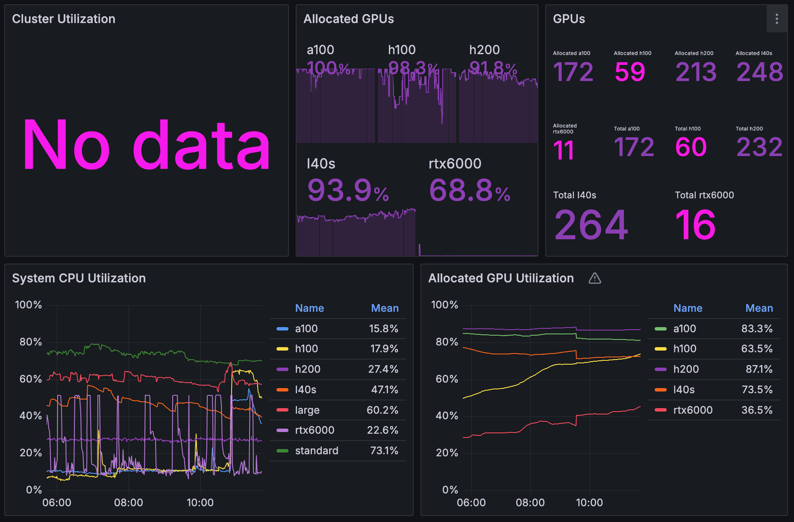
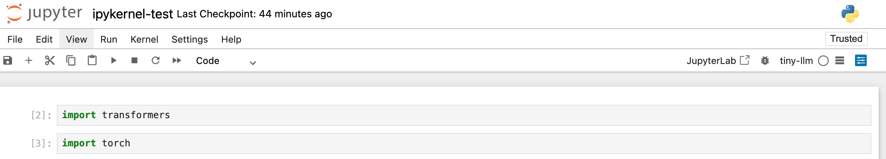

<p align="center">
  
</p>

This section aims to discuss the special properties of NYU Torch HPC. For general large scale shared HPC guide, see [hpcs-general](../hpcs-general/).

## Contents
- [Logging into Torch HPC](#logging-into-torch-hpc)
- [Projects & Priority](#projects--priority)
- [GPU availability](#gpu-availability)
- [Low GPU utilization](#low-gpu-utilization)
- [File system](#file-system)
- [Torch login node is fragile](#torch-login-node-is-fragile)
- [Torch HPC x ipython notebook](#torch-hpc-x-ipython-notebook)
- [Other resources](#other-resources)

## Logging into Torch HPC
The authentication process of Torch HPC is quite special. Normally you will be prompted to open a Microsoft authentication window, copy and paste a transient auth code, and log in via your NYU account:
```bash
# example
(yx3038@login.torch.hpc.nyu.edu) 
Authenticate with PIN XXXXXXXXX at 
https://login.microsoft.com/device and press ENTER.
```
<p align="center">
  
</p>

This can take a lot of time and is very annoying each time you switch to a new working directory. 

Fortunately, [Wenbo Lu](wenboluu.github.io) (a.k.a General LucArthur) has developed a lightweight tool [Ignition](https://github.com/wenboluu/Ignition) that exploits `expect` and master connection so you can log in once and then you can access the Torch HPC without extra authetication for a long period.

If you think this may save your time, plz check the guide in Ignition.

<details>
<summary><em>Note</em></summary>

In my experience sometimes trying `ignite` the first time returns
```bash
→ Auth may have failed or connection not ready.
```
Don't panic in such cases. Simply retry several times and you'll be able to log in:
```bash
→ SSH session ready. You're in.
```

</details>

## Projects \& Priority
The GPU types you can request and the priority of your requests are determined by **account** and **partition**. Of course when a job gets started are also determined by size, timestamp, fairshare, and dependencies.   
Currently, the Heavyball has been granted 4 accounts:
- `torch_pr_976_general, torch_pr_1030_general`: general account, lowest priority, unable to access A100 and H100.
- `torch_pr_1030_tandon_priority`: highest priority, but unable to access `h200_tandon`.
- `torch_pr_1030_tandon_advanced`: medium priority, able to access H200.

Below is a valid account-partition matrix:
| Account                         | A100          | H100          | H200                         |
| ------------------------------- | ------------- | ------------- | ---------------------------- |
| `torch_pr_976_general, torch_pr_1030_general`         | —             | —             | `h200_public` only           |
| `torch_pr_1030_tandon_advanced` | `a100_tandon` | `h100_tandon` | `h200_public`, `h200_tandon` |
| `torch_pr_1030_tandon_priority` | `a100_tandon` | `h100_tandon` | `h200_public` only           |

There are also many partitions we cannot access:
- `a100_cilvr` → CILVR lab only
- `a100_cds, h200_cds` → Center for Data Science only
- `a100_chemistry, h200_courant` → those departments only
- `h200_bpeher` → a specific PI's allocation
- `a100, h100, h200, *_plus` → likely require a special QOS or a different allocation account

Of course the available projects are subject to changes. You may visit the [torch projects website](https://projects.hpc.nyu.edu/project) to see your available projects.

## GPU availability

**Total system resources**

| Type     | Nodes | CPU Cores | GPUs | Memory (GB) | CPUs per Node | GPUs per Node | Memory per Node (GB) |
| -------- | ----- | --------- | ---- | ----------- | ------------- | ------------- | -------------------- |
| H200 GPU | 29    | 3,712     | 232  | 59,392      | 128           | 8             | 2,048                |
| H100 GPU | 15    | 1,440     | 60   | 23,040      | 96            | 4             | 1,536                |
| A100 GPU | 9     | 576       | 36   | 4,608       | 64            | 4             | 512                  |
| A100 GPU | 34    | 2,720     | 136  | 34,816      | 80            | 4             | 1,024                |

**Theoretical personal/group quotas**

| QOS           | Max GPUs per user | Max wall time | Notes                    |
| ------------- | ----------------- | ------------- | ------------------------ |
| `a100_tandon` | none set          | **unlimited** | Only group cap: 60 GPUs  |
| `h100_tandon` | none set          | **unlimited** | Only group cap: 60 GPUs  |
| `h200_tandon` | none set          | **unlimited** | Only group cap: 112 GPUs |

**Empirical personal/group quotas**

- it's possible to get ~20 gpus in total by one user, but very hard to get a single job with >=3 gpus. Consider requesting multi-node (e.g. 2 * 2 gpus).
- empirically, my friend told me it's possible to get **8-16 A100s, 4-8 H100s, 4-8 H200s** per user.

You might also want to check [system status](https://stats.apps.cloud.rt.nyu.edu) at the moment (snapshot taken 2026-05-21 11:45 CST), which means the system is insanely crowded!

<p align="center">
  
</p>

## Low GPU utilization
The Slurm system on Torch kills jobs with low GPU utilization. To prevent this during debugging, idle waits, or checkpoint reloads, run [`examples/keep_gpu_busy.py`](examples/keep_gpu_busy.py) alongside your real work — it loops small matmuls to keep `nvidia-smi` reporting ~100% util while using only a few MB of VRAM, leaving the rest free for the actual job.

```bash
# Cover every GPU in the allocation (one thread per visible device)
python examples/keep_gpu_busy.py &

# Auto-stop after 1 hour
python examples/keep_gpu_busy.py --duration 3600 &

# Pin to a specific GPU
python examples/keep_gpu_busy.py --device 0 &
```

The script honors `CUDA_VISIBLE_DEVICES`, so on a multi-GPU SLURM allocation it covers every granted GPU without extra flags. Background it (`&`, `nohup`, or a separate `tmux` pane) so it doesn't block your shell.

## File system
The file system on Torch is generally splitted into several areas:
```bash
Hostname: torch-login-a-0 at 2026-05-20 22:37:24

Filesystem   Environment       Backed up?   Allocation           Current Usage
Space        Variable          /Flushed?    Space / Files        Space(%) / Files(%)

/home        $HOME             YES/NO       0.05TB/0.03M         0.0TB(0.0%)/23708(79%)
/scratch     $SCRATCH          NO/YES       5.0TB/5.0M           0.02TB(0.0%)/153388(3%)
/archive     $ARCHIVE          YES/NO       2.0TB/0.02M          0.0TB(0.0%)/1(0%)
```
As you can see, 
- `$HOME` has the smallest space and limited file count, so only the most important files should be kept in `$HOME`.
- `$SCRATCH` has the largest space and file count, so that's where most of your code files and data should be stored.
- `$ARCHIVE` has a large space but very limited file count, so it will be a good place to store large files only (e.g. safetensors).

**Backup \& Flush**  

- `back up` means the files in this area are automatically stored in snapshots at a predefined time interval.
```bash
(base) [yx3038@torch-login-a-0 ~]$ cd .snapshot
(base) [yx3038@torch-login-a-0 .snapshot]$ ls
big_catalog_2026-05-21_01_46_14_UTC  torch.home._2026-04-27_04_00_00_UTC  torch.home._2026-05-05_04_00_00_UTC  torch.home._2026-05-13_04_00_00_UTC
big_catalog_2026-05-21_02_16_14_UTC  torch.home._2026-04-28_04_00_00_UTC  torch.home._2026-05-06_04_00_00_UTC  torch.home._2026-05-14_04_00_00_UTC
torch.home._2026-04-21_04_00_00_UTC  torch.home._2026-04-29_04_00_00_UTC  torch.home._2026-05-07_04_00_00_UTC  torch.home._2026-05-15_04_00_00_UTC
torch.home._2026-04-22_04_00_00_UTC  torch.home._2026-04-30_04_00_00_UTC  torch.home._2026-05-08_04_00_00_UTC  torch.home._2026-05-16_04_00_00_UTC
torch.home._2026-04-23_04_00_00_UTC  torch.home._2026-05-01_04_00_00_UTC  torch.home._2026-05-09_04_00_00_UTC  torch.home._2026-05-17_04_00_00_UTC
torch.home._2026-04-24_04_00_00_UTC  torch.home._2026-05-02_04_00_00_UTC  torch.home._2026-05-10_04_00_00_UTC  torch.home._2026-05-18_04_00_00_UTC
torch.home._2026-04-25_04_00_00_UTC  torch.home._2026-05-03_04_00_00_UTC  torch.home._2026-05-11_04_00_00_UTC  torch.home._2026-05-19_04_00_00_UTC
torch.home._2026-04-26_04_00_00_UTC  torch.home._2026-05-04_04_00_00_UTC  torch.home._2026-05-12_04_00_00_UTC  torch.home._2026-05-20_04_00_00_UTC
```
For instance, if you `cd torch.home._2026-05-20_04_00_00_UTC`, you will be able to access the `$HOME` directory at that timestamp:
```bash
(base) [yx3038@torch-login-a-0 .snapshot]$ cd torch.home._2026-05-20_04_00_00_UTC
(base) [yx3038@torch-login-a-0 torch.home._2026-05-20_04_00_00_UTC]$ ls -a
.   .anaconda      .bash_logout   .bashrc  .claude       .conda    .dotnet  .ssh      .vscode-remote-containers  .wget-hsts
..  .bash_history  .bash_profile  .cache   .claude.json  .copilot  .local   .viminfo  .vscode-server             miniconda.sh
```
- `flush` means all the files that you have not accessed for **60 days** will be automatically deleted by the system.

**Symlink Trick**  

Sometimes packages simply default to save files in `$HOME` which can easily blow up your storage (e.g. `.claude`, pip cache dir, `CONDA_ENVS_PATH`). Of course it makes sense to manually change the environment variables in `.bashrc`, but an alternative would be using **symlinks**.

For instance, you may simply use `ln -s $SCRATCH/.claude ~/.claude` to redirect the dir that claude code saves the logs. **A caveat** here is that in this case the logs will not be backed up by the snapshots, **since the snapshot only contains the symlink**, not the actual files.

## Torch login node is fragile
Torch login node is very fragile and you might be kicked out for various operations:
1. downloading and installing large packages like `torch`;
2. downloading large models and datasets from huggingface;
3. spawning many processes or using many `watch` to monitor status;
4. running Claude Code/Codex in auto mode (which potentially involves lots of bash command executions);
5. connecting with VSCode and open windows with a huge amount of text or conduct many file operations via the GUI (instead of CLI).

Normally it will be fine to do `5`, just be aware that you might want to use `tail`, `head`, `grep`, `ls`, `vim`, `mv`, `rm`,  to view and operate on your files.

For `1-4`, fortunately the computing nodes on Torch can reach the external network, so a common solution is to request a CPU node, ssh to the CPU node, then these operations on that node. 

## Torch HPC x ipython notebook
Sometimes you may want to run ipython notebook with the computing power on Torch (e.g. a ipynb demo online or your homework). In that case you will need the [Torch OOD service](https://ood.torch.hpc.nyu.edu).

**Configure your environment**

Assume you already have a python environment (in my case, it's a conda env), do the following:
```bash
# step 1: install ipykernel in your conda env
conda activate <env_name>
conda install ipykernel --yes                                                            
# step 2: copy the kernel template
mkdir -p ~/.local/share/jupyter/kernels
cp -R /share/apps/kernel_template ~/.local/share/jupyter/kernels/<env_name>
# step 3: configure your kernel settings
vim ~/.local/share/jupyter/kernels/<env_name>/kernel.json
```
```json
{
  "argv": [
    "<conda_path>/bin/python",
    "-Xfrozen_modules=off",
    "-m",
    "ipykernel_launcher",
    "-f",
    "{connection_file}"
  ],
  "display_name": "<env_name>",
  "language": "python",
  "metadata": {
    "debugger": true
  }
}
```
Then you are all set!

**Open an ipython notebook**   

See [here](https://services.rt.nyu.edu/docs/hpc/ood/jupyter_with_conda_singularity/#launch-an-ood-jupyter-notebook).

**Example of successfully built ipykernel**

<p align="center">
  
</p>

As you can see we chose the `tiny-llm` kernel and we can use `torch` and `transformers` in the notebook since they are installed in the conda env `tiny-llm`.

## Other resources
- [Torch HPC website](https://www.nyu.edu/life/information-technology/research-computing-services/high-performance-computing/high-performance-computing-nyu-it.html?challenge=d06e90d7-4d8f-4b88-9d8c-10b73beb60f1)
- [Torch HPC docs](https://services.rt.nyu.edu/docs/hpc/getting_started/intro/)
- [Torch HPC projects](https://projects.hpc.nyu.edu/project)
- [Torch Open OnDemand](https://ood.torch.hpc.nyu.edu)
- [Torch System status](https://stats.apps.cloud.rt.nyu.edu)
- [Torch HPC cheatsheet](https://github.com/RicercarG/NYU-Torch-HPC-Cheatsheet)
- [Ignition](https://github.com/wenboluu/Ignition)
